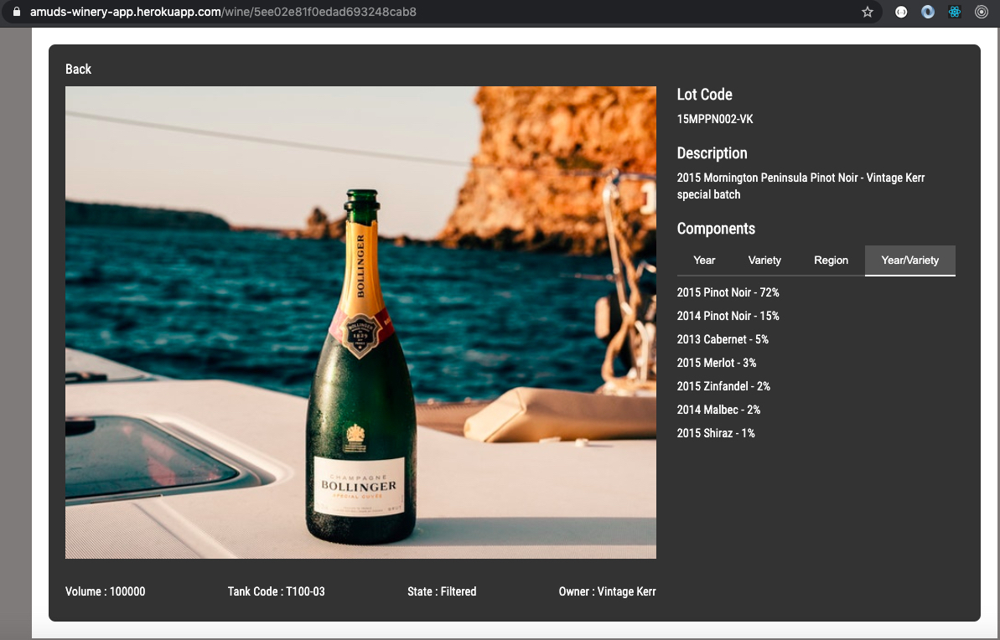

# A Wine List App written in ReactJs with NodeJs & MongoDB

#### Watch it in action at https://amuds-winery-app.herokuapp.com/

## Features
- Provides a list of all wines in the database
- Search functionality that instantly filters the wine list based on Lot Code & Description
- Each Wine in the list Opens a Wine Details page upon click
- Wine Detail Page provides all the information on the wine including the breakdown of components by year, variety, region, year & variety
- Designed to be Responsive for mobile & tablets

## Technology
### FrontEnd
- ReactJs with React Hooks for State management
- CSS3 for styling
- Axios for HTTP requests
### BackEnd
* Connects to a NodeJS API
* ExpressJs used as a Server
* NoSQL Database MongoDB used for datastore
* 5 API Endpoints that provides 
  * List of all Wines
  * Year BreakDown for a given wine
  * Variety BreakDown for a given wine
  * Region BreakDown for a given wine
  * Year & Variety BreakDown for a given wine

